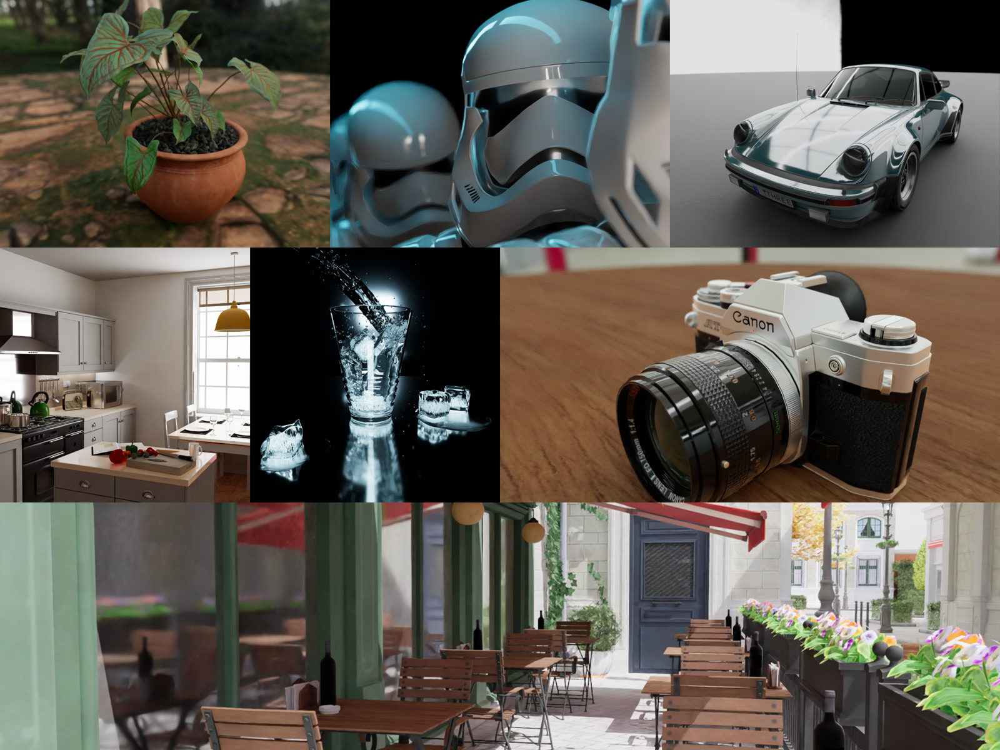

# Rayzee - Real-Time Path Tracer

[](https://www.npmjs.com/package/rayzee)
[](https://www.npmjs.com/package/rayzee)
[](https://www.npmjs.com/package/rayzee)
[](https://www.jsdelivr.com/package/npm/rayzee)

A real-time path tracer that runs entirely in the browser. Rayzee combines a WebGPU wavefront Monte Carlo core, a two-level BVH, and TSL shaders compiled to WGSL to deliver physically based global illumination with interactive frame rates.

<p align="center">
  
</p>

🌐 **[Launch App](https://atul-mourya.github.io/RayTracing/)**

The project is a monorepo with two packages: **`rayzee/`** — the standalone rendering engine, publishable to npm — and **`app/`** — the React UI built on top of it. External clients can use the engine independently:

```js
import { PathTracerApp } from 'rayzee';
```

## Highlights

- **Wavefront path tracer** — decomposed `generate → extend → shade → compact` compute kernels with stream compaction, driving a Monte Carlo core with configurable multi-bounce transport and progressive accumulation
- **Two-level BVH** — SAH-built TLAS/BLAS acceleration structure with treelet optimization, constructed off the main thread via Web Workers so scene loads don't block rendering
- **Real-time + final-quality denoising** — ASVGF spatiotemporal filtering for interactive navigation, Intel Open Image Denoise (OIDN) for clean final renders, and an edge-preserving bilateral filter in between
- **HDR image-based lighting** with CDF importance sampling for accurate, noise-efficient environment illumination
- **Full PBR material pipeline** with live, real-time editing of materials, camera, depth of field, and environment — no re-render required to see a change
- **Depth of field** with photographic controls (focal length, aperture, focus distance) and click-to-focus
- **Interaction Mode** — automatically drops quality during camera movement and restores full fidelity the moment you stop, keeping navigation responsive
- **Broad asset support** — GLB, GLTF, FBX, OBJ, STL, PLY, DAE, 3MF, and USDZ models; HDR/EXR environments; ZIP archives with automatic model detection
- **Multiple tone-mapping operators** (ACES, AgX, Reinhard, and more) with automatic exposure adjustment

## Tech Stack

| Category | Technologies |
|----------|-------------|
| **Frontend** | React 19, Vite 8, TailwindCSS 4 |
| **3D Rendering** | Three.js 0.185+, WebGPU, TSL Shaders (WGSL) |
| **UI Components** | Radix UI, Lucide Icons |
| **State Management** | Zustand |
| **Denoising** | Intel OIDN Web, Custom ASVGF |
| **Build Tools** | Vite, ESLint, Semantic Release |
| **Performance** | Stats.gl |

## Quick Start

**Prerequisites**: Node.js >= 20.19.0 and a browser with WebGPU support (Chrome 113+, Edge 113+, or Firefox Nightly).

```bash
git clone https://github.com/atul-mourya/RayTracing.git
cd RayTracing
npm install        # installs both rayzee/ and app/ workspaces
npm run dev         # http://localhost:5173
```

```bash
npm run build          # build engine + app
npm run build:engine   # rayzee engine only (ESM + UMD)
npm run build:app      # React app only
npm run preview        # preview the production build
```

## Keyboard Shortcuts

| Key | Action |
|-----|--------|
| `Space` | Toggle rendering pause/play |
| `W` / `E` | Translate / rotate the transform gizmo (when an object is selected) |
| `R` | Scale the gizmo (object selected) — otherwise resets the camera to its default position |
| `Esc` | Deselect current object |

## Usage

Drag and drop a model (GLB, GLTF, FBX, OBJ, STL, PLY, DAE, 3MF, USDZ — or a ZIP containing one) onto the canvas, or pick from the built-in model and HDRI library. Adjust samples, bounces, and denoising in the Path Tracer panel, edit PBR materials directly on selected objects, and switch between Interactive and Production render modes as you work. Completed renders are saved to a local results gallery for review and export.

See [CONTRIBUTING.md](CONTRIBUTING.md) for the full walkthrough and development workflow.

## Architecture

Rayzee runs an event-driven, stage-based render pipeline: a wavefront `PathTracer` core feeds `NormalDepth`, `MotionVector`, `ASVGF`, `Variance`, `BilateralFilter`, `EdgeFilter`, `AutoExposure`, and a terminal `Compositor` stage, each communicating through a shared `PipelineContext` and event bus rather than direct references. The engine (`rayzee/`) is fully decoupled from the UI — it's consumable standalone via `import { PathTracerApp } from 'rayzee'` — while the React app (`app/`) wires engine events into Zustand stores.

For the full stage breakdown and shader architecture, see [docs/PIPELINE_ARCHITECTURE.md](docs/PIPELINE_ARCHITECTURE.md) and [docs/PATH_TRACER_SHADER_ARCHITECTURE.md](docs/PATH_TRACER_SHADER_ARCHITECTURE.md).

## Contributing

We welcome contributions! See [CONTRIBUTING.md](CONTRIBUTING.md) for getting started, code style, and the pull request process.

## License

This project is licensed under the MIT License — see the [LICENSE](LICENSE) file for details.

---

**Built with ❤️ by [Atul Mourya](https://github.com/atul-mourya)**
