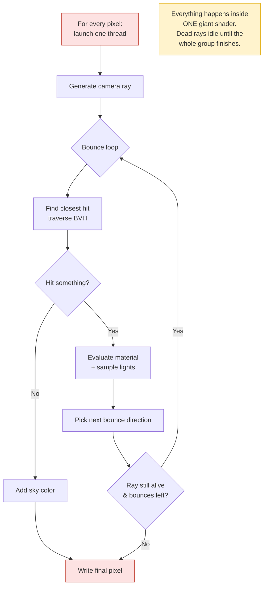
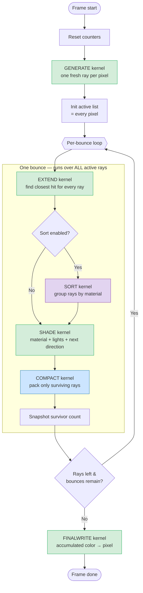
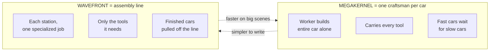

# Wavefront vs. Megakernel Path Tracing — A Plain-English Guide

*A walkthrough of how Rayzee's GPU path tracer is organized, why we split one giant
shader into a chain of small ones, and the trade-offs that come with it.*

---

## 1. Start with the problem: what is a path tracer even doing?

A path tracer makes a photorealistic image by **following light backwards**. For every
pixel on screen, it shoots a ray out from the camera into the 3D scene and asks:

1. **What did I hit?** (a wall, a glass, the sky…)
2. **What's the surface like?** (shiny metal, rough wood, clear glass…)
3. **Where does the light bounce next?** (pick a new direction)

Then it repeats steps 1–3 for the new ray. Each repeat is a **bounce**. After a handful
of bounces the ray either escapes into the sky or runs out of energy, and we add up all
the light it collected along the way. That sum is the pixel's color.

> **Analogy.** Imagine standing in a dark room with a single laser pointer. You shine it
> at a wall, it reflects to the floor, the floor reflects to a mirror, the mirror sends it
> out the window. To know how bright that first spot on the wall *looks*, you had to trace
> the whole journey. A path tracer does this for **every pixel**, **millions of times**,
> per frame.

The whole question of "megakernel vs. wavefront" is just: **how do we organize all this
work on the GPU?**

---

## 2. A quick word on how GPUs like to work

This one fact explains everything that follows, so it's worth 30 seconds.

A GPU doesn't run threads one at a time. It runs them in **groups that march in
lockstep** — think of a group of ~32 soldiers who must all take the same step at the same
time. (NVIDIA calls a group a "warp", everyone else calls it a "wavefront" — yes, that's
where the name comes from.)

If every soldier in the group is doing the same thing, they march fast and efficiently.
But the moment they **disagree** — soldier #3 needs to handle glass, soldier #7 hit the
sky, soldier #12 is deep inside a diffuse bounce — the group can't march together. They
have to take turns, and everyone else **stands and waits**. This is called **divergence**,
and it's the #1 enemy of GPU performance.

> **Analogy.** A rowing crew. Eight rowers in one boat are blazing fast *if they stroke
> together*. If each rower decides to do their own thing, the boat barely moves — not
> because anyone is lazy, but because they keep waiting on each other.

Keep this picture in your head: **GPUs reward sameness and punish difference.**

---

## 3. The Megakernel approach — "one worker builds the whole car"

The classic, simplest design is the **megakernel**. You write **one enormous shader
program** that does *everything* — generate the ray, find the hit, evaluate the material,
pick the next direction, loop for the next bounce — all inside a single `for` loop, all in
one GPU program.

```
for each pixel (one GPU thread):
    ray = generate()
    for bounce in 0..maxBounces:
        hit = findClosestHit(ray)        # traverse the BVH
        if missed: add sky color; break
        color += directLighting(hit)     # sample lights
        ray  = sampleNextDirection(hit)  # bounce
        if rayDied: break
    writePixel(color)
```

> **Analogy.** A single craftsman builds an entire car by themselves at one bench. They
> fetch the chassis, weld it, wire the electronics, paint it, install the engine,
> upholster the seats — start to finish, alone.

This is **wonderfully simple**. It's how most beginner (and many shipping) path tracers
are written. But it has two deep problems on a GPU:

**Problem 1 — Divergence (the rowing-crew problem).**
Remember the lockstep group of 32 threads. Pixel A's ray hits clear glass and goes down
the expensive refraction code. Pixel B's ray hits the sky on bounce one and is *done*. But
B can't leave — it's chained to A in the same group. So B sits idle while A grinds through
glass. Across a real scene, threads finish at wildly different times, and the fast ones
waste enormous amounts of time **waiting**.

> A class where everyone must finish the exam before *anyone* can leave the room — the
> whole class moves at the speed of the slowest student on the hardest question.

**Problem 2 — Register pressure (the "carry every tool" problem).**
Because one program does *everything*, it must hold the code and temporary data for *every*
possibility at once — glass math, metal math, light sampling, sky lookup, fog… The GPU has
a fixed, small amount of fast scratch memory (registers). A program that needs a lot of it
can only keep a few thread-groups in flight at a time, so when one group stalls waiting on
memory, there aren't enough other groups ready to fill the gap. The GPU sits half-idle.

> Our craftsman has to keep welding gear, paint guns, wiring kits, and engine hoists **all
> on the bench at once**. The bench is cramped, and only one or two craftsmen fit in the
> workshop.

---

## 4. The Wavefront approach — "an assembly line of specialists"

The **wavefront** design (this is what Rayzee uses) flips it around. Instead of one giant
program, we break the work into a **chain of small, specialized programs** — called
**kernels** — and run them one after another. Each kernel does *one job* for *all the rays*
before handing off to the next.

> **Analogy.** A car **assembly line**. Station 1 only welds chassis. Station 2 only does
> wiring. Station 3 only paints. Each station is staffed by specialists with exactly the
> tools for that one job — no clutter, no waiting on unrelated work. Cars flow down the
> line; each station processes whatever arrives.

The rays (and everything we know about them) live in **big GPU buffers** between kernels —
like cars parked in the lot between stations. Each kernel reads the buffer, does its bit,
writes back, and the next kernel picks up.

### The kernels in Rayzee (in order)

| Kernel | Real-world station | What it does |
|---|---|---|
| **Generate** | "Cut the raw steel" | Create one fresh camera ray per pixel; set defaults |
| **Extend** | "Find what it hit" | Traverse the BVH; record the closest surface for every ray |
| **Sort** *(optional)* | "Group by paint color" | Reorder rays so similar materials sit together |
| **Shade** | "Do the surface work" | Evaluate the material, sample lights, pick the next bounce direction |
| **Compact** | "Pull finished cars off the line" | Build a tight list of *only the rays still alive* |
| **FinalWrite** | "Drive it off the lot" | Take the accumulated color and write the final pixel |

That sequence (Extend → Shade → Compact) runs **once per bounce**, in a loop. Generate runs
once at the start, FinalWrite once at the end.

### How this fixes the two problems

**It fixes divergence** because each kernel is *uniform* — every thread in the Shade kernel
is shading; every thread in Extend is traversing. Threads in a lockstep group are finally
doing the same kind of work, so they march together.

**It fixes register pressure** because each small kernel only needs the tools for *its* one
job. The Extend kernel doesn't carry paint guns. With a lighter tool load, the GPU can keep
**many more** thread-groups in flight, so there's always someone ready to work when another
group stalls on memory.

---

## 5. The secret sauce: stream compaction

This is the part that makes wavefront *really* pay off, and it's worth understanding well.

After every bounce, some rays die — they hit the sky, or they ran out of energy. In the
megakernel, those dead threads just sit in their group, idling, dragging down the survivors.

In wavefront, the **Compact** kernel does something clever: it builds a **fresh, tightly
packed list of only the rays that are still alive**. Dead rays are dropped. The next bounce
only launches enough threads for the survivors.

> **Analogy.** A relay race that *narrows the track* each lap. Lap 1 has 1000 runners. By
> lap 3, only 200 are still running — so we shrink the track to fit exactly 200 and stop
> reserving lanes for the 800 who already finished. No empty lanes, no wasted space.

Concretely in Rayzee: rays carry a small set of status bits (alive? specular? inside
glass? how many bounces so far?) packed into their data. After Shade, a set of **counters**
tallies the survivors, and Compact rewrites the active list so the next round's kernels are
sized to **exactly** the rays that remain. Early bounces are wide (lots of rays); later
bounces are narrow (only the deep, glassy, complex paths survive). We even peek at the
previous frame's survivor curve to size each dispatch tightly and **exit the loop early**
when almost nothing is left.

This is the structural win: **the megakernel keeps paying for dead rays; the wavefront
stops paying the moment they die.**

---

## 6. The optional "Sort" station — grouping by material

There's one more trick. Even within the Shade kernel, threads can diverge: one ray hit
glass, its neighbor hit metal, and now the group is split between two very different
material codes.

The **Sort** kernel (optional in Rayzee) reorders the surviving rays *by which material
they hit* before shading. Now the lockstep groups are full of like-with-like: a group of
all-glass rays, a group of all-metal rays.

> **Analogy.** A paint shop that **batches cars by color**. Instead of red-blue-red-green
> coming down the line and the sprayer constantly swapping and cleaning the nozzle, you
> send *all the red cars together*, then all the blue. The sprayer never switches mid-batch.

Sorting isn't free (reordering takes work), so it's a tunable: worth it on
material-heavy scenes, skippable on simple ones.

---

## 7. The full picture — flowcharts

### Megakernel: one program, everything inside one loop



### Wavefront: a chain of specialized kernels, looping per bounce



### The mental model side-by-side



---

## 8. Pros and cons — the honest scorecard

### Megakernel

**Pros**
- **Dead simple to write and debug.** It's just one program with a loop. You can read it
  top to bottom.
- **No buffer plumbing.** State lives in local variables; nothing is written out between
  stages, so no extra memory traffic.
- **Great for simple scenes.** If most rays behave alike, divergence barely bites and the
  simplicity wins.

**Cons**
- **Divergence kills it** on complex scenes — fast rays idle while slow ones grind.
- **High register pressure** → low GPU occupancy → the hardware sits half-used.
- **Pays for dead rays forever** — a finished ray still occupies its lane until its whole
  group is done.

### Wavefront

**Pros**
- **Less divergence.** Each kernel is uniform; lockstep groups do the same work.
- **Lower register pressure per kernel** → higher occupancy → the GPU stays busy.
- **Compaction stops paying for dead rays** — later bounces only launch threads for
  survivors, and can exit early.
- **Enables material sorting** to crush divergence even further.
- **Modular.** Each kernel is small and independently testable/optimizable.

**Cons**
- **Much more complex.** Many kernels, a per-bounce loop on the CPU side, careful ordering.
- **Memory traffic between kernels.** Ray state must be written to and read from GPU buffers
  every stage — that bandwidth isn't free.
- **More VRAM.** Those big ray/hit/queue buffers (the "parking lots") cost memory the
  megakernel never needed.
- **Overhead can lose on small/simple scenes.** If there's little divergence to fix and few
  dead rays to compact, the bookkeeping can cost more than it saves. Wavefront wins on
  *heavy* workloads, not trivial ones.

---

## 9. The one-paragraph summary to remember

> A **megakernel** is one worker building an entire car alone — simple, but the fast workers
> wait on the slow ones and everyone's bench is cluttered with every tool. A **wavefront**
> path tracer is an **assembly line**: each station does one specialized job on every car,
> using only the tools it needs, and finished cars get pulled off the line so no station
> wastes effort on them. The line is more complicated to build and needs more parking space
> (memory), but on busy days (complex scenes) it massively out-produces the lone craftsman.
> Rayzee runs the line as **Generate → Extend → (Sort) → Shade → Compact → FinalWrite**,
> looping the middle three once per light bounce.

---

*For the implementation details — the exact GPU buffer layout, the ray status bits, and the
per-bounce dispatch sizing — see `docs/PATH_TRACER_SHADER_ARCHITECTURE.md` and the kernels
in `rayzee/src/TSL/*Kernel.js`.*
